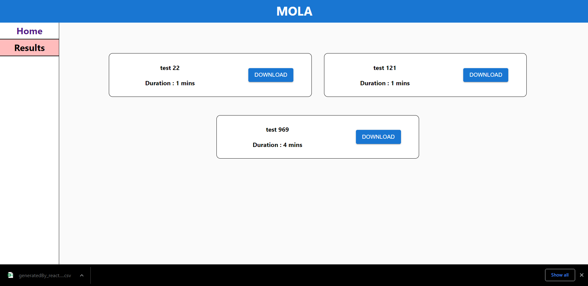

tech stack used -

Frontend - react js

backend - Node js

Database - Mongodb


project setup

-> Root folder consist of node project and client folder consist of react project.

-> Run npm install in root and client folder respectively

-> add a .env file in root folder with following structure
```
MONGODB_URL={your mongodb uri}
PORT=5000
```
Few screenshots below

<p>
    Home screen
  
  <br>
    Screen after user clicks on start, a new survey loads taking 10 random questions from excel sheet
  
    <br>
    Submit button
  
    <br>
    Selecting options
  
    <br>
    Click on submit which triggers confirm submit
  
 Results page which displays all the surveys with duration and download link
  <br>
  
    <br>
    Action after clicking on download
  
    <br>
    Excel Sheet with responses
  
    <br>
    Mongodb database
  

</p>